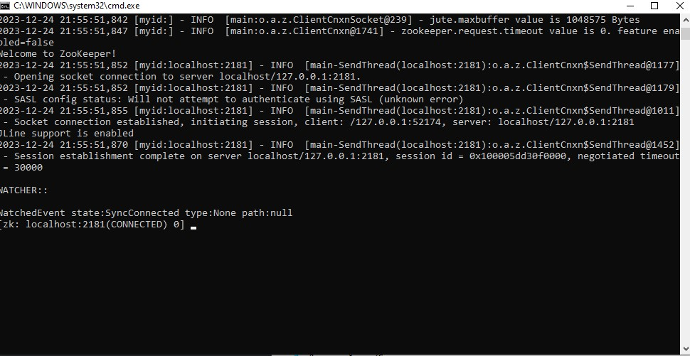
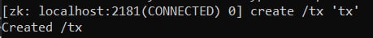

<h1>Задания по 4 лабораторной работе</h1>

- В Windows запустите сервер двойным кликом по скрипту zkServer.cmd в папке ./bin/ или из терминала, набрав zkServer.cmd

<h1>Взаимодействие с ZooKeeper через CLI</h1>

- Устанавливаем подключение к ZooKeeper CLI сессии:

<h1>Запуск zoo</h1>

<h1>Запуск philosophers</h1>

Philosopher 3 is going to eat

Philosopher 2 is going to eat

Philosopher 1 is going to eat

Philosopher 4 is going to eat

Philosopher 0 is going to eat

Philosopher 4 picked up the left fork

Philosopher 1 picked up the left fork

Philosopher 1 picked up the right fork

Philosopher 4 picked up the right fork

Philosopher 3 picked up the left fork

Philosopher 1 put the right fork

Philosopher 1 put the loft fork and finished eating

Philosopher 2 picked up the left fork

Philosopher 1 is thinking

Philosopher 4 put the right fork

Philosopher 5 picked up the left fork

Philosopher 5 picked up the right fork

Philosopher 4 put the loft fork and finished eating

Philosopher 4 is thinking

Philosopher 3 picked up the right fork

Philosopher 0 is going to eat

Philosopher 3 is going to eat

Philosopher 3 put the right fork

Philosopher 3 put the loft fork and finished eating

Philosopher 2 picked up the right fork

Philosopher 3 is thinking

Philosopher 5 put the right fork

Philosopher 1 picked up the left fork

Philosopher 4 picked up the right fork

Philosopher 5 put the loft fork and finished eating

Philosopher 5 is thinking

Philosopher 2 put the right fork

Philosopher 2 put the loft fork and finished eating

Philosopher 1 picked up the right fork

Philosopher 4 is going to eat

Philosopher 1 put the right fork

Philosopher 1 put the loft fork and finished eating

Philosopher 1 is thinking

Philosopher 1 is going to eat

Philosopher 2 picked up the left fork

Philosopher 2 picked up the right fork

Philosopher 2 is going to eat

Philosopher 4 put the right fork

Philosopher 4 put the loft fork and finished eating

Philosopher 5 picked up the left fork

Philosopher 4 is thinking

Philosopher 5 picked up the right fork

Philosopher 2 put the right fork

Philosopher 2 put the loft fork and finished eating

Philosopher 2 is thinking

Philosopher 3 picked up the left fork

Philosopher 3 picked up the right fork

Philosopher 3 put the right fork

Philosopher 3 put the loft fork and finished eating

Philosopher 3 is thinking

Philosopher 5 put the right fork

Philosopher 5 put the loft fork and finished eating

Philosopher 5 is thinking

<h1>Запуск двухфазного коммита</h1>

- создаем /tx
  

- клиенты
  

- координатор

